# HelloGIT
Exercises in GIT.

NOTE: This is not a definitive guide on git and git hub. It just follows one simple workflow proposal.

## Prerequisites
- [ ] Github account
- [ ] Access to this repository
- [ ] git client installed (one option [here](https://git-scm.com/downloads))

## Basic flow
- [x] Create a github repository

    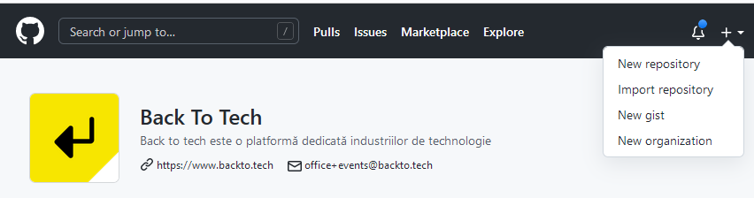


- [x] Clone the repository: 
    
    * Get the repository address from github
    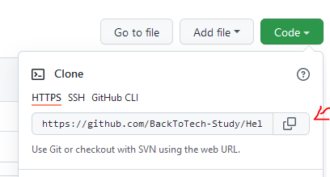

    * In the console navigate, with the change directory command ([`cd`](https://www.howtogeek.com/659411/how-to-change-directories-in-command-prompt-on-windows-10/)) , to the desired folder 
    * Clone the repository with the [`git clone`](https://git-scm.com/docs/git-clone) command.
    ```
        git clone https://github.com/BackToTech-Study/HelloGIT.git
    ```


- [x] Chek repository status

    * In the console navigate to the folder created by the clone operation. 
    ```
        cd HelloGIT
    ```
    
    * Check the status of your repository by typing the [`git status`](https://git-scm.com/docs/git-status) command

    * If you haven't created any new brances you should get a message that indicates you are on the `main` branch:
    ```
        git status
    ```        
    ```
        On branch main
        Your branch is up to date with 'origin/main'.
        ...
    ```

    * Git will ignore empty folders as they are considered to have no added value.


- [x] Update the repository

    * Before you start working on something new, new feature implementation or bugfix, make sure you have all the latest updates on the `main` branch by running [`git pull`](https://git-scm.com/docs/git-pull)
    ```
        git pull
    ```

    NOTE: this command will not overwrite any chages made localy.

- [x] Create a branch

    * You can use [`git checkout -b`](https://git-scm.com/docs/git-checkout) to create a new branch.

    * It's generaly a good practice to derive all your branches from the latest version of the `main` branch. So before creating a new branch you can make sure that you are on the `main` branch and that the `main` branch is up to date by typing:

    ```
        git checkout main
        git pull
    ```
    
    * The name of your new branch should reflect what you want to do. for example `feature/AddNewComponent` or `bugfix/ArrangeTitle`. This will be usefull when communicating with your coleagues. NOTE: Ask your project manager if there are any branch naming rules you should follow.

    ```
        git checkout -b feature/AddInitialExercise
    ```

    * This operation will create the new branch and will automaticaly move you to the created branch. Check this by observing the result of `git status`.
    ```
        On branch feature/AddInitialExercise
    ```

    * The newly created branch exists only on you computer.

    * You can also use the `git checkout` command to switch between brnaches. You should make sure that you make changes on the branch you created, not on the `main` branch.

    * Once you are on your brnach it's time to make the planned project updates. 

    * RECOMMANDATION: Don't use the same branch to create unrelated changes. If you have 2 features to implement use 2 different branches. 

    * RECOMMANDATION: Each branch should be derived from the `main` branch. Some projects might use another branch as `main`. Check with your project manager to see that branches you should use as sources.

- [x] Ignore files / folders

    * After you made changes to your branch you can type `git status` to see what git detected:
    ```
    On branch feature/AddInitialExercise
    Changes not staged for commit:
        (use "git add <file>..." to update what will be committed)
        (use "git restore <file>..." to discard changes in working directory)
            modified:   README.md

    Untracked files:
        (use "git add <file>..." to include in what will be committed)
            .gitignore
            Local Environment data/
            Resources/
            accountKeys.json
            src/
    ```

    * If you want some files not to be tracked by git you can add them to a special file named [`.gitignore`](https://git-scm.com/docs/gitignore)

    * If your repository has a `.gitignore` file you can update it. Otherwise you can create one in the root folder of your repository.
    ```
        Directory: C:\...\HelloGIT

        Length Name
        ------ ----
        Local Environment data
        Resources
        src
        .gitignore
        accountKeys.json
        LICENSE
        README.md
    ```

    * To ignore a folder open the `.gitignore` file and add to it the file or folder name that you want to ignore.

        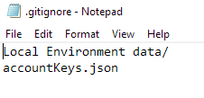

    * Check the output of `git status` after updating the `.gitignore` file.
        ```
        On branch feature/AddInitialExercise
        Changes not staged for commit:
            (use "git add <file>..." to update what will be committed)
            (use "git restore <file>..." to discard changes in working directory)
                modified:   README.md

        Untracked files:
            (use "git add <file>..." to include in what will be committed)
                .gitignore
                Resources/
                src/
        ```

    * RECOMMANDATION: ALWAYS add to `.gitignore` files that contain user names and password, because you don't want to upload these to the server. Unfortunatly uploading secrets to the git server is a common security error.

    * RECOMMANDATION: Another good practice is to ignore files and folders generated by the compilation process or the code editor you are using. Example `obj`, `bin`, `.vs` directories.

- [x] Add files for commit

    * To add/stage/mark chaged files so they can be commited to git you can use the command [`git add`](https://git-scm.com/docs/git-add)

    ```
        git add .gitignore
    ```
    ```
        git status
    ```
    ```
        On branch feature/AddInitialExercise
        Changes to be committed:
            (use "git restore --staged <file>..." to unstage)
                    new file:   .gitignore

        Changes not staged for commit:
            (use "git add <file>..." to update what will be committed)
            (use "git restore <file>..." to discard changes in working directory)
                    modified:   README.md

        Untracked files:
            (use "git add <file>..." to include in what will be committed)
                    Resources/
                    src/
    ```
    ```
        git add Resouces
        git add src
    ```
    ```
        git status
    ```
    ```
        On branch feature/AddInitialExercise
        Changes to be committed:
            (use "git restore --staged <file>..." to unstage)
                    new file:   .gitignore
                    new file:   Resources/GetGithubRepo.PNG
                    new file:   Resources/GitHubNewRepo.PNG
                    new file:   Resources/GitIgnore.PNG
                    new file:   src/index.html

        Changes not staged for commit:
            (use "git add <file>..." to update what will be committed)
            (use "git restore <file>..." to discard changes in working directory)
                    modified:   README.md    
    ```

    * NOTE: When you add a folder the conent of that folder is added if not in the `.gitignore` file.

    * You can add all the `not staged` and `untracked` content with the command `git add *` but you should use this carefully.

- [x] Commit changes

    * To commit/save changes to the github local repository you can use the command [`git commit -m`](https://git-scm.com/docs/git-commit)

    * You will need to provide a commit message. This will be used later, in the git history, to identify changes made, so make it descriptive for the changes you made but keep it short.

    ```
        git commit -m "intiated the exercise content"
    ```

    * Only the changes stages with `git add` will be commited. See output of the command `git status`

    ```
        On branch feature/AddInitialExercise
        Changes not staged for commit:
            (use "git add <file>..." to update what will be committed)
            (use "git restore <file>..." to discard changes in working directory)
                    modified:   README.md    
    ```

    * Now you have commited the changed but the brnach still exists only on your local machine. Your coleagues can't see what changes you made.

- [x] Publish branch

    * You can push/publish/upload your branch to the server with the command [`git push`](https://git-scm.com/docs/git-push)

    ```
        git push --set-upstream origin feature/AddInitialExercise
    ```

    * After that you should be able to see the changes in github
        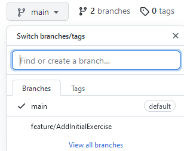


- [x] Make a pull request

    * To make a proposal of merging the changes from your branch to the `main` branch go to your branch and create a pull request.

        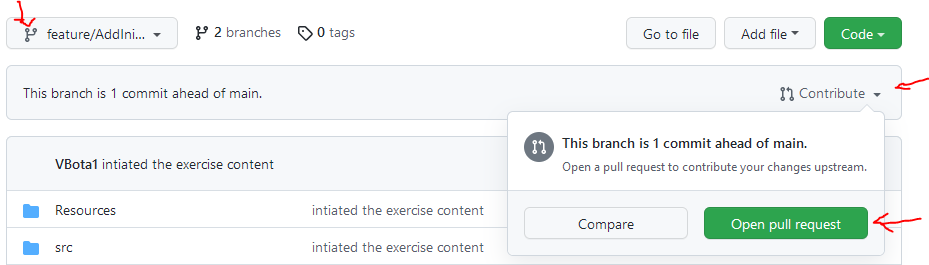

    * In the screen that opens up you can set a pull request title and add more details. You can also add coleagues that need to review and aprove the changes you made. 

    * RECOMMANDATION: You should not merge pull requests that are not reviewed. 4 eyes are better than 2 :D.
        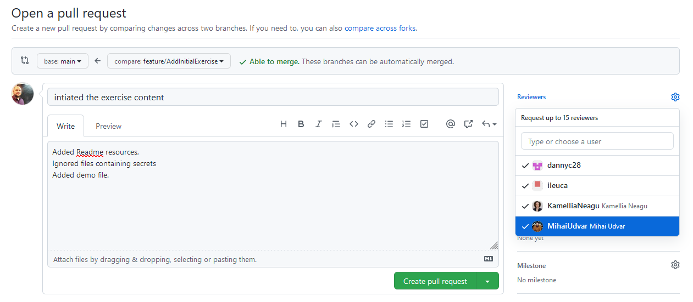

- [x] Make review

    * A reviewer can check the proposed changes in the cretated pull request.
        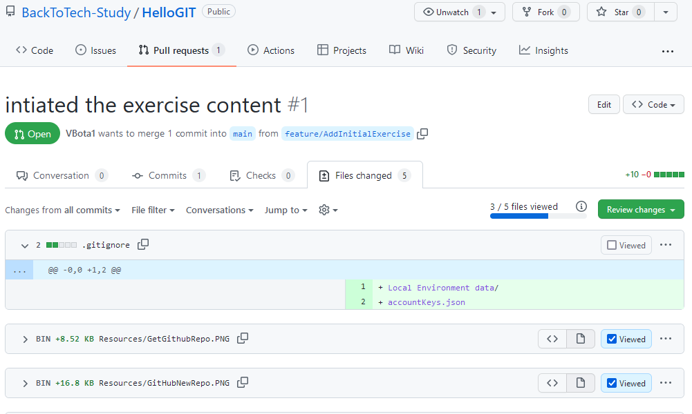

    * A reviewer can also add comments to the pull request.
        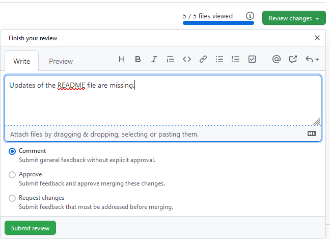

    * You can see and reply to the comment in the pull request.
        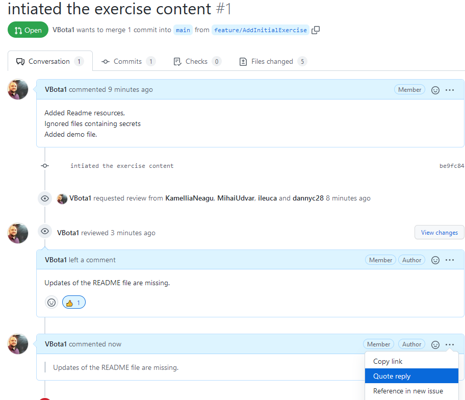


- [x] Make changes

    * If you need to update the pull request simply update the branch on your local machine.

    1. Verify that you are on the branch that was used to create the Pull Request by using `git status`.

    ```
        On branch feature/AddInitialExercise
        Your branch is up to date with 'origin/feature/AddInitialExercise'.
    ```

    2. If you are not on the wright branch checkout the branch `git checkout feature/AddInitialExercise` 

    3. Make the required updates.

    4. Add the changes with `git add`

    5. Commit with `git commit -m "added missing files"`

    6. Then push the changes with `git push`

    * The pull request will be updated automaticaly after you push the changes to the server.

    * The commit history will be visible in the pull request
        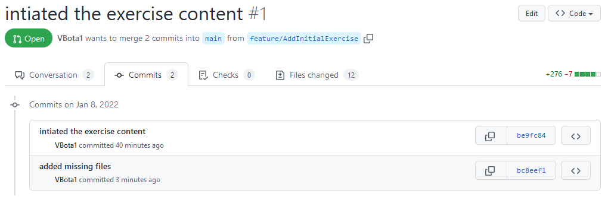

    * RECOMMANDATION: The reviewest should check and aprove the updates made before merging the pull request.

- [x] Merge pull request

    * After you and your coleagues agree that the pull request can be merged you can to this from the pull request window.

        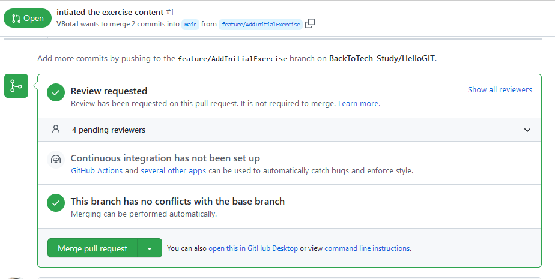

    * Once the pull request was merged the branch can be deleted.

- [x] Delete a branch
    * To delete the branch on the local machine, first switch to another branch.
    ```
        git checkout main
    ```
    
    * Then use the command [`git branch -d`](https://git-scm.com/docs/git-branch)
    ```
        git branch -d feature/AddInitialExercise
    ```

    * To bring localy the result of the merge operation remember to use `git pull` afer you switched to the `main` branch.

## Other topics
- [x] Resolve conflicts
- [x] Restore a changed file

    * To restore a file, that was changes but not yet staged for commit, use the command [`git restore`](https://git-scm.com/docs/git-restore)

        1. Change `src\index.html`
        2. Observer the result of `git status`
        3. Restore `src\index.html`
        ```
            git restore src\index.html
        ```
        4. Observer the result of `git status`

- [x] [Github Squashing commits](https://docs.github.com/en/desktop/contributing-and-collaborating-using-github-desktop/managing-commits/squashing-commits)
    * Squashing allows you to combine multiple commits in your branch's history into a single commit. This can help keep your repository's history more readable and understandable.

    * In github when merging a pull request you can choose the option of squashing togheter all the commits done on that branch. This reduces the size of the git history.

    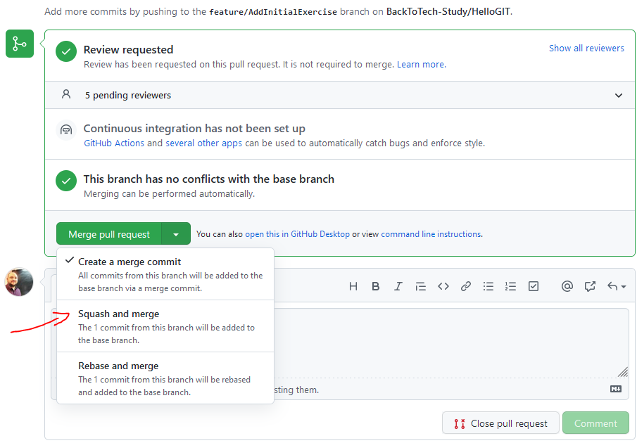

- [x] View history 
- [ ] Compare with history 
- [x] Remove a tracked file

1. Add the file to .gitignore
2. Remove the file from the index `git rm --cached filename`
3. Commit the change `git commit -m "Removed tracking for filename"`

## Summary of most used commands

    1. git switch main 
    2. git pull
    3. git checkout myBranch
    4. make updates
    5. git add ....
    6. git commit -m "relevant message"
    7. git push
    8. create pull request and request review
